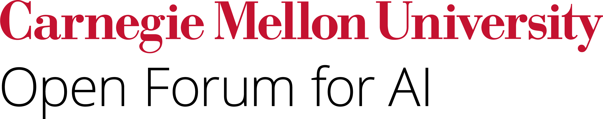

 

# Public Sector AI Curriculum
In order to prepare professionals to work with open-source AI in the public sector, Carnegie Mellon University’s Heinz College of Information Systems and Public Policy has released an open-source curriculum of four courses: Introduction to AI; Fundamentals of Operationalizing AI: Mastering AI System Lifecycle from Theory to Practice; Responsible AI: Principles, Policies, and Practices; and Generative AI: Applications, Implications, and Governance. Collectively, these courses introduce students to the knowledge and skills requisite to understand the foundations of AI design and implementation, including opportunities, risks, limitations, and frontier developments.
In order to prepare professionals to work with open-source AI... including opportunities, risks, limitations, and frontier developments.   

  <strong>Jump to:</strong>
  <ul style="margin-top: 0.5em;">
    <li><a href="#introduction-to-ai">Introduction to AI</a></li>
    <li><a href="#fundamentals-of-operationalizing-ai-mastering-ai-system-lifecycle-from-theory-to-practice">Fundamentals of Operationalizing AI</a></li>
    <li><a href="#responsible-ai-principles-policies-practices">Responsible AI</a></li>
    <li><a href="#generative-ai-applications-implications-and-governance">Generative AI</a></li>
  </ul>

  
## Introduction to AI
### Skills
- **Communication and Interpersonal Skills:** Written and verbal communication, teamwork and collaboration, conflict resolution
- **Analysis and Critical Thinking Skills:** Broad socio-technical perspective, ethical analysis, policy analysis
- **Applied and Functional Skills:** Project management, problem scoping, applying AI to specific problems, understanding uses and limitations of AI
- **Technical Skills:** Data collection, analysis, processing; programming; foundational AI concepts (ML, LLMs, neural networks, etc.)  

### Syllabus
<iframe src="Introduction to AI.pdf" width="100%" height="600px"></iframe>   

  

## Fundamentals of Operationalizing AI: Mastering AI System Lifecycle from Theory to Practice
### Skills
- **Communication, Critical Thinking, and Interpersonal Skills:** written and verbal communication, teamwork and collaboration, systems thinking
- **Strategy and Innovation Skills:** project management, business strategy, cost-benefit and ROI analysis
- **Ethics and Governance Skills:** risk evaluation and mitigation, governance frameworks,  ethical and policy analysis
- **Technical and AI Interaction Skills:** end-to-end AI lifecycle management, MLOps, Jupyter Lab, Docker, Kubernetes, Kubeflow, Kafka, Evidently, basic data science   

### Syllabus
<iframe src="Operationalizing AI.pdf" width="100%" height="600px"></iframe>   

  

## Responsible AI: Principles, Policies, Practices
### Skills
- **Communication and Interpersonal Skills:** teamwork and collaboration, written and verbal communication
- **Ethics and Governance Skills:** NIST AI Risk Management Framework, governance strategy, regulatory fluency, ethical analysis, policy analysis, impact assessments and audits 
- **Technical and AI Interaction Skills:** foundational concepts of AI; understanding explainability, transparency, interpretability, bias, and fairness of models; privacy and security   

### Syllabus
<iframe src="Responsible AI.pdf" width="100%" height="600px"></iframe>   
  

## Generative AI: Applications, Implications, and Governance
### Skills
- **Communication, Strategy, and Critical Thinking Skills:** strategic literacy, policy analysis, policy writing, regulatory fluency
- **Technical and AI Interaction Skills:** AI fluency, foundational concepts of generative AI, adaptability to new technologies, applications of AI   
  
### Syllabus
<iframe src="GenAI.pdf" width="100%" height="600px"></iframe>

  

  <h3><strong>Developing Your Own Curriculum</strong></h3>  
 The above syllabi outline content and readings relevant to the learning objectives covered by each course. In order to build upon the syllabi and develop courses relevant to your specific student population, LLM prompts can be useful for developing detailed course materials and related activities.   
 
<strong>For example, these prompts can help develop content and activities related to specific content:</strong>
  <ul style="margin-top: 0.5em;">
    <li>Based on this syllabus, create an interactive activity that focuses on <em>AI interpretability methods</em> for a class of <em>20 graduate students</em>. It should be done in <em>small groups</em> and take approximately <em>20-30 minutes</em>.</li>  
   <li>Based on this syllabus, create a <em>60-minute</em> lesson on <em>the EU AI Act</em> for a class of <em>graduate students</em>.</li>  
  </ul>
   
<strong>These prompts can help develop activities related to specific skills:</strong>
  <ul style="margin-top: 0.5em;">
    <li>Based on this syllabus, create an interactive activity that focuses on <em>AI-related policy writing</em> for a class of <em>35 undergraduate students</em>. It should be done in <em>pairs</em> and take approximately <em>15 minutes</em>.</li>  
   <li>Based on this syllabus, create a lesson that teaches students to use <em>cost-benefit analysis to evaluate social returns from AI implementation</em>em> for a class of <em>graduate students</em>. The lesson should take approximately <em>80 minutes</em> and should include interactive activities done individually, in pairs, or in groups.</li>   
  </ul>

<strong>Tips for using LLMs for Curriculum Development:</strong>
  <ul style="margin-top: 0.5em;">
<li>Try entering these prompts into several different LLMs, such as NotebookLM and several chatbots.</li>  
<li>Use sufficient context to prompt the LLM, i.e. "I am creating lessons for a 14-week-long programming-intensive course that provides an overview of foundational AI concepts and techniques, such as ML, model evaluations, neural networks, computer vision, large language models, and natural language processing as well as real-world applications, including their limitations and social implications. The class is for graduate students. Each class is 80 minutes and should incorporate individual, partner, or group activities in addition to lectures (supported by slides)."</li>  
  </ul>

